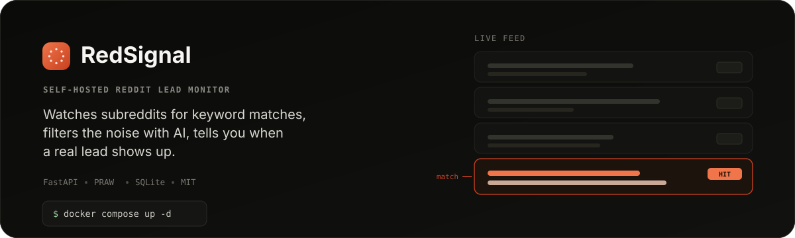
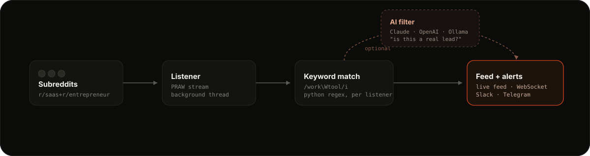

<p align="center">
  
</p>

<p align="center">
  <a href="https://buymeacoffee.com/ivucicev"></a>
  
  
</p>

Reddit is one of the few places where people still describe real problems in their own words. Someone in r/entrepreneur asking which CRM handles their workflow is a warm lead — but Reddit barely surfaces in search, and browsing subreddits by hand only works if you remember to and the timing lines up.

RedSignal runs in the background, watches the subreddits you choose for keyword matches, and — optionally — asks Claude, OpenAI, or a local Ollama model to throw out anything that isn't actually relevant before it reaches you.

## Proof

| Live feed | Analytics |
|---|---|
|  |  |

| Listener settings | Vault |
|---|---|
|  |  |

## How it works

<p align="center">
  
</p>

A listener watches one or more subreddits (or all of Reddit) for regex keyword patterns. A match lands in your live feed, where you can read the thread in context, draft a reply, and track it as a lead — New → Reviewing → Replied → Converted → Skipped.

The AI filter step is optional. Write a prompt like *"is this person looking for a tool that does X"* and the model answers yes or no before the hit ever reaches your feed, so you're not wading through keyword matches that happen to use your term in an irrelevant context.

Everything lives locally in SQLite. No data leaves your machine except the Reddit API calls and whatever AI provider you connect.

## Quick start

**Docker** (recommended for running on a server)

```bash
git clone https://github.com/ivucicev/redsignal.git
cd redsignal
cp .env.example .env   # fill in your values
docker compose up -d
```

**Local development** — needs Python 3.11+

```bash
git clone https://github.com/ivucicev/redsignal.git
cd redsignal
./start.sh
```

Either way, open `http://localhost:8000`. Data persists in `./data/redsignal.db` (or `127.0.0.1:8000` with auto-reload for local dev).

## First-time setup

1. **Get Reddit API credentials.** Create a "script" app at [reddit.com/prefs/apps](https://www.reddit.com/prefs/apps) — you'll get a client ID and secret.
2. **Add credentials in the Vault tab.** Add your Reddit account with client ID, secret, and a user agent (`myapp/1.0 by u/yourname`). Add an Anthropic, OpenAI, or Ollama key too if you want AI filtering.
3. **Create a listener.** In the Listeners tab, assign your Reddit account, set subreddits (`entrepreneur+SaaS+smallbusiness`, or `all` for everything), and add keyword regex patterns. Click Start — it streams immediately.
4. **Set up AI filtering (optional).** Inside listener settings, add a step under AI Filter Pipeline with a plain-English prompt describing a relevant post.
5. **Set up notifications (optional).** Add a Slack webhook or Telegram bot token in listener settings. AI-passed hits send a richer message with the filter reasoning included.

<details>
<summary><strong>Using the feed, analytics, schedule windows, and logs</strong></summary>

**The feed.** The Stream tab is your main view — new hits appear at the top as they arrive, older ones load below with a "Load older" button. Each card has four actions: Open (jump to the Reddit post), Thread (load the full comment thread in a side panel), Reply (Claude drafts a context-aware reply from a description of your product), and Analyze (run the AI filter manually). Filter by kind (post/comment), by listener, or switch to History mode to search everything stored in the database.

**Analytics.** Charts built from your stored hit history: volume over time, top subreddits, top keywords, activity by hour/day, AI pass rates, and most active authors. Filter by 7d / 30d / 90d / all time.

**Schedule windows.** If a listener should only run during business hours or on weekdays, enable Schedule Window in its settings — pick a timezone, days, and start/end hours. It pauses and resumes automatically.

**Logs.** System logs capture listener starts, stops, and errors. Webhook logs show every outgoing notification with status, attempt count, and last response, with a manual retry button on failures.

</details>

## Environment variables

| Variable | Description | Default |
|---|---|---|
| `DB_PATH` | Path to the SQLite database file | `data/redsignal.db` |
| `APP_USER` | Username for HTTP basic auth | none (auth disabled) |
| `APP_PASSWORD` | Password for HTTP basic auth | none (auth disabled) |
| `PORT` | Port to bind the server to | `8000` |

Set both `APP_USER` and `APP_PASSWORD` to put the whole app behind basic auth — useful when running on a public server.

## Tech stack

- **FastAPI** for the backend API and WebSocket
- **PRAW** for the Reddit streaming API
- **SQLite** in WAL mode for persistent storage
- **Anthropic / OpenAI / Ollama** for AI filtering and reply drafting
- **Tailwind CSS** and **Chart.js** from CDN, no build step
- **Docker Compose** for deployment

Each listener runs its own Reddit stream in a background thread. Hits flow into an asyncio queue and broadcast to every connected WebSocket client in real time.

## License

MIT
