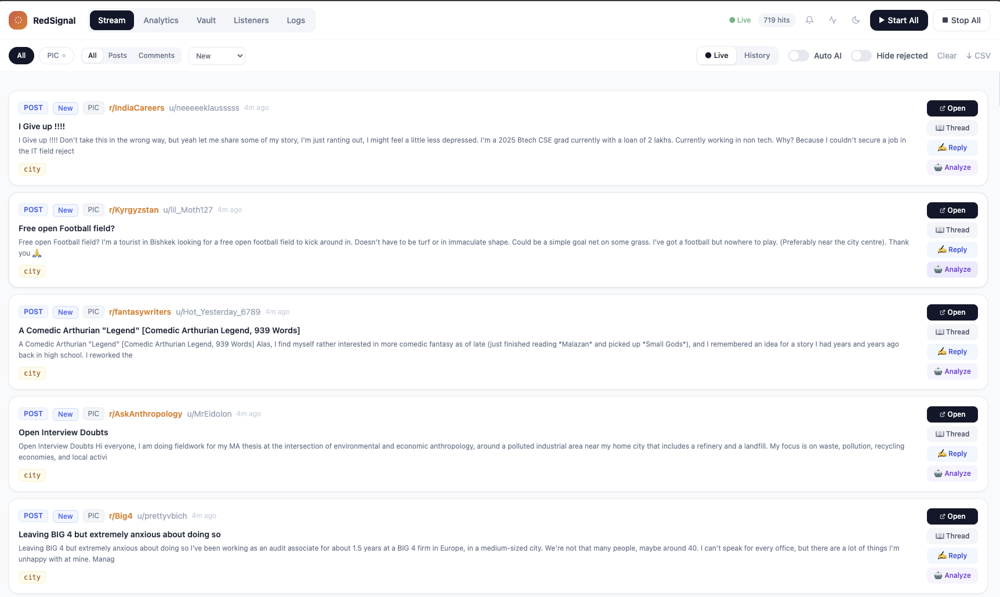
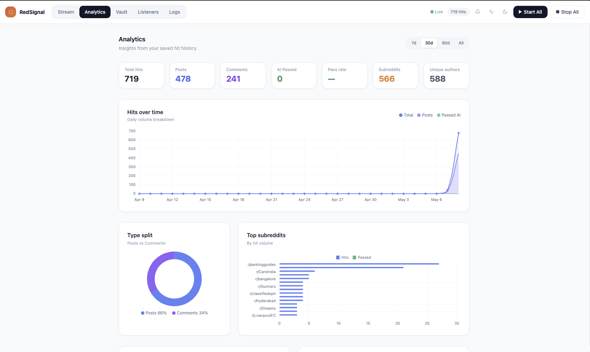
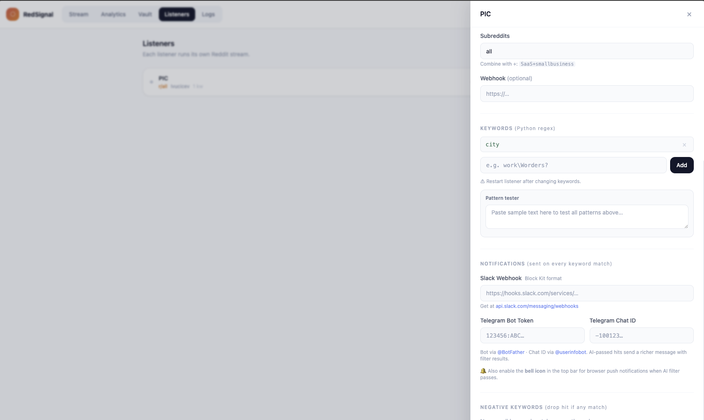
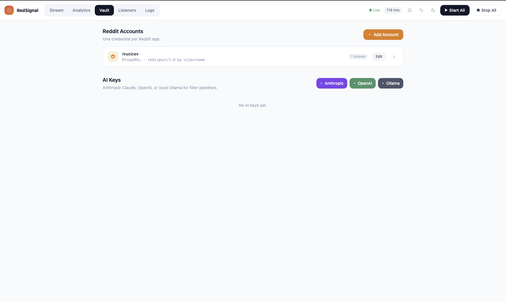

# RedSignal

Reddit monitoring for people who are tired of manually scrolling for leads.


[](https://buymeacoffee.com/ivucicev)

---

## Why this exists

Reddit is one of the few places on the internet where people still ask genuine questions and share real problems. If someone posts in r/entrepreneur asking which CRM handles their workflow, that is a warm lead. They are already describing their pain, already looking for a solution, and they will get replies from real people including your competitors.

The problem is finding those posts. You can set up Google Alerts but Reddit barely surfaces in search. You can manually browse subreddits but that only works if you remember to do it and if the timing aligns. Most people just miss it.

RedSignal runs in the background and watches Reddit for you. You define the keywords, it finds the matches, and you decide what to do with them. You can layer Claude, OpenAI, or a local Ollama model on top to filter out noise before anything even reaches your feed. When something real comes through, you get it.

---

## What it does

You create listeners. Each listener watches one or more subreddits (or all of Reddit) for keyword patterns you define. When a post or comment matches, it shows up in the live feed. From there you can read the thread in context, draft a reply, track its status as a lead, and get notified via Slack or Telegram.

The AI filter step is optional but useful. You write a prompt like "is this person looking for a tool that does X" and the model answers yes or no before the hit lands in your feed. This way you are not wading through keyword matches that happen to use your term in a completely irrelevant context.

Everything is stored locally in SQLite. No data leaves your machine except the Reddit API calls and any AI provider you connect.

---

## Screenshots

**Live feed**



**Analytics**



**Listener settings**



**Vault**



---

## Running it

### Option 1: Docker (recommended for running on a server)

You need Docker and Docker Compose installed.

```bash
git clone https://github.com/yourname/redsignal.git
cd redsignal
cp .env.example .env
```

Open `.env` and fill in your values. Then start it:

```bash
docker compose up -d
```

Open `http://localhost:8000` in your browser. The app persists all data in `./data/redsignal.db` so it survives restarts.

To stop it:

```bash
docker compose down
```

### Option 2: Local development

You need Python 3.11 or newer.

```bash
git clone https://github.com/yourname/redsignal.git
cd redsignal
./start.sh
```

The script creates a virtual environment, installs dependencies, and starts the server at `http://127.0.0.1:8000` with auto-reload.

---

## First time setup

### 1. Get Reddit API credentials

Go to [reddit.com/prefs/apps](https://www.reddit.com/prefs/apps) and create a new app. Choose "script" as the type. You will get a client ID and client secret.

### 2. Add credentials in the Vault tab

Open the app and go to the Vault tab. Add your Reddit account with the client ID, client secret, and a user agent string. The user agent format Reddit expects looks like `myapp/1.0 by u/yourname`.

If you want AI filtering, also add an Anthropic, OpenAI, or Ollama key in the same tab.

### 3. Create a listener

Go to the Listeners tab and click New Listener. Assign it your Reddit account. Set the subreddits you want to watch (comma-separate them with plus signs like `entrepreneur+SaaS+smallbusiness`, or use `all` to watch everything). Add your keywords as regex patterns.

Click Start and it begins streaming immediately.

### 4. Set up AI filtering (optional)

Inside the listener settings, scroll down to AI Filter Pipeline and add a step. Write a plain English prompt telling the model what a relevant post looks like and asking it to reply YES or NO. Enable it and the model will evaluate every keyword match before it reaches your feed.

### 5. Set up notifications (optional)

Still inside listener settings, you can add a Slack webhook or Telegram bot token. Hits will be posted there as they arrive. If you have AI filtering on, passing hits send a richer message with the filter reasoning included.

---

## How to use the feed

The Stream tab is your main view. New hits appear at the top as they come in. Older hits from previous sessions load below them with a "Load older" button.

Each card has four actions on the right side. Open takes you straight to the Reddit post. Thread loads the full comment thread in a side panel so you do not have to leave the app. Reply opens a panel where you describe your product and Claude writes a context-aware reply you can edit and copy. Analyze runs the AI filter on that specific hit manually.

You can also set a status on each hit. The options are New, Reviewing, Replied, Converted, and Skipped. This is a basic CRM workflow so you can track what you have already acted on.

The kind filter at the top lets you see only posts or only comments. The stream filter lets you focus on a single listener. You can also switch to History mode to search and filter everything stored in the database.

---

## Analytics

The Analytics tab shows charts built from your stored hit history. You can see volume over time, which subreddits generate the most hits, which keywords match most often, activity by hour of day and day of week, AI pass rates per subreddit, and the most active authors.

Use the time range selector at the top right to filter by last 7 days, 30 days, 90 days, or all time.

---

## Schedule windows

If you only care about hits during business hours, or you want the listener to run only on weekdays, open the listener settings and enable the Schedule Window section. You pick the timezone, which days to run, and the start and end hours. The listener pauses automatically outside that window and resumes when the window opens again.

---

## Webhook retry and logs

The Logs tab shows two things. System logs capture listener starts and stops, errors, and other internal events. Webhook logs show every outgoing notification with its status, how many attempts were made, and the last response. If a delivery failed you can retry it manually from there.

---

## Environment variables

| Variable | Description | Default |
|---|---|---|
| `DB_PATH` | Path to the SQLite database file | `data/redsignal.db` |
| `APP_USER` | Username for HTTP basic auth | none (auth disabled) |
| `APP_PASSWORD` | Password for HTTP basic auth | none (auth disabled) |
| `PORT` | Port to bind the server to | `8000` |

If you set both `APP_USER` and `APP_PASSWORD` the entire app is protected with basic auth. Useful when running on a public server.

---

## Tech stack

- **FastAPI** for the backend API and WebSocket
- **PRAW** for the Reddit streaming API
- **SQLite** for persistent storage, running in WAL mode
- **Anthropic / OpenAI / Ollama** for AI filtering and reply drafting
- **Tailwind CSS** and **Chart.js** loaded from CDN, no build step
- **Docker Compose** for deployment

The Reddit listener runs in a background thread per listener. Hits flow from the thread into an asyncio queue and get broadcast to all connected WebSocket clients in real time.

---

## License

MIT
